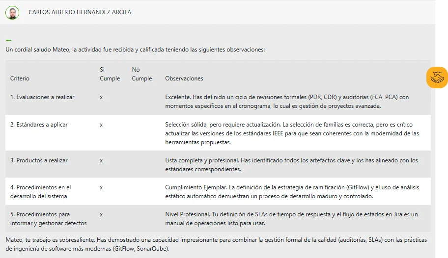

# Plan de Aseguramiento de Calidad (SQA) - Sistema de Gestión Clínica

> **Reconocido por "capacidad impresionante para combinar gestión formal de calidad con prácticas modernas"**

## 📋 Descripción del Proyecto

Plan completo de **Software Quality Assurance (SQA)** para un sistema crítico de gestión hospitalaria desarrollado por la empresa ficticia SoftSena. Este documento establece los mecanismos, procedimientos y responsabilidades para garantizar que el software cumpla con los estándares de calidad y requisitos establecidos.

**Sistema:** Gestión Clínica (Hospital Management System)  
**Cliente:** Clínica de Salud  
**Curso:** SENA - Calidad del Software (RAP2)  
**Fecha:** Diciembre 2025

---

## 🏆 Reconocimiento del Instructor

<details>
<summary><b>📸 Ver feedback completo</b></summary>

> **"Tu trabajo es sobresaliente. Has demostrado una capacidad impresionante para combinar la gestión formal de la calidad (auditorías, SLAs) con las prácticas de ingeniería de software más modernas (GitFlow, SonarQube)."**
> 
> — **Carlos Alberto Hernández Arcila**  
> Instructor SENA - Calidad del Software  
> Diciembre 2025

**Criterios evaluados (todos cumplidos):**
1. ✅ Evaluaciones a realizar - Excelente
2. ✅ Estándares a aplicar - Selección sólida
3. ✅ Productos a realizar - Lista completa y profesional
4. ✅ Procedimientos en desarrollo - Cumplimiento ejemplar (GitFlow, análisis estático)
5. ✅ Procedimientos para informar defectos - Nivel profesional (SLAs, Jira)



</details>

---

## 🎯 Alcance del Sistema

### Módulos del Sistema de Gestión Clínica:

1. **Ingreso y Hospitalización**
   - Admisión de pacientes
   - Asignación de camas
   - Historias clínicas

2. **Información del Paciente**
   - Datos demográficos
   - Historial médico
   - Alergias y condiciones

3. **Habitaciones y Camas**
   - Disponibilidad en tiempo real
   - Mantenimiento
   - Asignación automática

4. **Medicamentos y Materiales**
   - Inventario farmacéutico
   - Control de lotes
   - Prescripciones médicas

5. **Costos de Hospitalización**
   - Facturación
   - Seguros médicos
   - Reportes financieros

6. **Consulta de Disponibilidad**
   - Citas médicas
   - Agenda de doctores
   - Salas de operación

---

## 📚 Estándares y Referencias

El plan se fundamenta en estándares internacionales de la industria:

### IEEE Standards
- ✅ **IEEE 730-2002** - Planes de Aseguramiento de Calidad del Software
- ✅ **IEEE 829-1998** - Documentación de Pruebas de Software
- ✅ **IEEE 830-1998** - Especificaciones de Requisitos de Software
- ✅ **IEEE 1012-2004** - Verificación y Validación

### ISO Standards
- ✅ **ISO 9001** - Sistemas de Gestión de Calidad
- ✅ **ISO/IEC 12207** - Procesos del Ciclo de Vida del Software
- ✅ **ISO/IEC 25000 (SQuaRE)** - Requisitos y Evaluación de Calidad
- ✅ **ISO/IEC 25010** - Modelo de Calidad del Software

---

## 👥 Estructura del Equipo SQA

| Rol | Responsabilidades Principales |
|-----|-------------------------------|
| **Líder SQA** | • Coordinar equipo de calidad<br>• Asegurar cumplimiento del plan<br>• Reportar estado de calidad a dirección |
| **Administrador de Desarrollo** | • Controlar avance en diseño y desarrollo<br>• Verificar estándares de codificación<br>• Supervisar revisiones de código |
| **Administrador de Calidad** | • Definir métricas de calidad<br>• Realizar auditorías periódicas<br>• Gestionar no conformidades |

---

## 🔄 Actividades de Aseguramiento

### 1. Revisión de Productos

**Artefactos revisados:**
- Especificación de Requisitos (SRS)
- Documentos de Diseño (Arquitectura, UML, DB)
- Código Fuente (Inspecciones Fagan)
- Casos de Prueba (Test Plans, Test Cases)
- Documentación de Usuario (Manuales, Guías)
- Documentación Técnica (APIs, Deployment)

### 2. Revisiones Técnicas Formales

| Revisión | Momento | Enfoque |
|----------|---------|---------|
| **PDR** (Preliminary Design Review) | Semana 8 | Arquitectura del sistema |
| **CDR** (Critical Design Review) | Semana 12 | Diseño detallado de componentes |
| **FCA** (Functional Configuration Audit) | Cada Sprint | Funcionalidades completadas |
| **PCA** (Physical Configuration Audit) | Pre-Release | Sistema completo integrado |

### 3. Control de Desviaciones

**Proceso:**
1. Documentar la desviación con evidencia
2. Notificar al equipo de desarrollo
3. Elaborar plan de acciones correctivas
4. Escalamiento si no se resuelve en tiempo
5. Verificar implementación de correcciones

---

## 🛠️ Gestión de Configuración (SCM)

### Herramientas Modernas

- **Sistema:** Git / GitLab Enterprise
- **Estrategia:** GitFlow Workflow
- **CI/CD:** Jenkins / GitLab CI
- **Análisis Estático:** SonarQube Enterprise

### Estrategia GitFlow

```
main          ─────●─────────●─────────●───── (Producción)
               ╱     ╲       ╱         ╱
release/*  ───●───────●─────●─────────●────── (Pre-producción)
             ╱         ╲   ╱         ╱
develop   ──●───●───●───●─●─────●───●──────── (Desarrollo)
           ╱   ╱   ╱         ╲   ╲   ╲
feature/* ●───●   ●           ●───●───●────── (Nuevas funcionalidades)
          
hotfix/*                ●────────●──────────── (Correcciones urgentes)
```

**Ramas:**
- `main` - Código en producción
- `develop` - Integración continua
- `feature/*` - Nuevas funcionalidades
- `release/*` - Preparación de releases
- `hotfix/*` - Correcciones urgentes

### Control de Cambios

**Flujo:**
1. **Solicitud** - Change Request (CR) en Jira
2. **Evaluación** - Change Control Board (CCB)
3. **Aprobación** - Decisión documentada
4. **Implementación** - Rama feature dedicada
5. **Revisión** - Code review + QA
6. **Verificación** - Testing completo
7. **Merge** - Integración a develop

---

## 📊 Métricas de Calidad

### Métricas Principales

| Métrica | Fórmula | Meta | Propósito |
|---------|---------|------|-----------|
| **Densidad de Defectos** | Defectos / KLOC | ≤ 2 | Medir calidad del código |
| **Cobertura de Código** | (Líneas cubiertas / Total) × 100 | ≥ 80% | Asegurar testing completo |
| **Adherencia al Cronograma** | (Tareas a tiempo / Total) × 100 | ≥ 85% | Control de plazos |
| **Tasa de Éxito de Pruebas** | (Pruebas pasadas / Total) × 100 | ≥ 95% | Validar funcionalidad |

### Métricas de Proceso

- **Tiempo medio de resolución de defectos** - Por severidad
- **Backlog de defectos abiertos** - Tendencia semanal
- **Velocidad del equipo** - Story points por sprint
- **Technical debt** - Análisis SonarQube

---

## 🔍 Verificación y Validación

### Inspecciones de Código

**Método:** Fagan Inspection  
**Frecuencia:** Cada commit significativo  
**Checklist:**
- Cumplimiento de estándares de codificación
- Manejo adecuado de excepciones
- Seguridad (OWASP Top 10)
- Performance y optimización
- Documentación inline

### Análisis Estático Automatizado

**Herramienta:** SonarQube Enterprise  
**Integración:** CI/CD pipeline automático  
**Quality Gates:**
- 0 bugs bloqueantes
- 0 vulnerabilidades críticas
- Coverage ≥ 80%
- Code smells < 5% del código
- Duplicación < 3%

### Walkthroughs de Diseño

**Momento:** Post-diseño de componentes críticos  
**Participantes:** Arquitecto + Desarrolladores + QA  
**Objetivo:** Validar decisiones de diseño tempranamente

### Pruebas de Seguridad

**Herramienta:** OWASP ZAP  
**Frecuencia:** Antes de cada release  
**Alcance:** Todas las APIs y endpoints web

---

## 🐛 Gestión de Defectos

### Clasificación de Severidad

| Nivel | Descripción | SLA Resolución |
|-------|-------------|----------------|
| **Crítico** | Sistema no funcional, pérdida de datos | 4 horas |
| **Alto** | Funcionalidad principal afectada | 24 horas |
| **Medio** | Funcionalidad secundaria con workaround | 72 horas |
| **Bajo** | Mejoras cosméticas o UX | Próximo sprint |

### Flujo de Defectos en Jira

```
Detección → Registro (Jira) → Clasificación (Severidad)
     ↓
Asignación → Análisis de Causa Raíz → Corrección (rama bugfix)
     ↓
Verificación (QA) → Cierre → Retrospectiva
```

### Análisis de Causa Raíz

**Técnicas aplicadas:**
- 5 Whys para defectos recurrentes
- Fishbone Diagram para problemas complejos
- Pareto Analysis para priorización

---

## 📄 Documentación del Proyecto

### Requerimientos
- SRS (IEEE 830) - Especificación completa
- Casos de Uso - User stories detalladas
- Matriz de Trazabilidad - Req → Test

### Diseño
- Arquitectura del Sistema
- Diagramas UML (Clases, Secuencia, Componentes)
- Diseño de Base de Datos (ER, normalización)
- Especificaciones de APIs (OpenAPI/Swagger)

### Verificación & Validación
- Plan de Pruebas (IEEE 829)
- Casos de Prueba detallados
- Reportes de Ejecución
- Matrices de Cobertura

### Usuario
- Manuales de Usuario por rol
- Guías de Instalación y Configuración
- Tutoriales y FAQs
- Videos demostrativos

### Configuración
- Plan SCM (Software Configuration Management)
- Registro de Configuration Items
- Control de Cambios
- Baseline Management

---

## 🎯 Integración de Prácticas Modernas

### Destacado por el Instructor

Este proyecto fue reconocido por combinar exitosamente:

**✅ Gestión Formal de Calidad (Tradicional):**
- Auditorías formales (PDR, CDR, FCA, PCA)
- SLAs por severidad de defectos
- Estándares IEEE e ISO

**✅ Prácticas Modernas de Ingeniería:**
- GitFlow para control de versiones
- SonarQube para análisis estático automatizado
- CI/CD pipelines
- Jira para gestión ágil

Esta combinación demuestra comprensión tanto de prácticas establecidas de la industria como de metodologías ágiles modernas.

---

## 💡 Lecciones Aprendidas

### 1. **Auditorías No Son Solo Burocracia**
Las revisiones formales (PDR, CDR) detectan problemas arquitecturales antes de que sean costosos de corregir.

### 2. **Automatización es Clave**
SonarQube integrado en CI/CD proporciona feedback inmediato sin intervención manual.

### 3. **SLAs Claros Evitan Confusión**
Definir tiempos de resolución por severidad elimina ambigüedad en priorización.

### 4. **GitFlow Facilita Trazabilidad**
Cada cambio tiene una rama dedicada, facilitando auditorías y rollbacks.

### 5. **Métricas Deben Ser Accionables**
No solo medir, sino definir thresholds claros y consecuencias.

---

## 📁 Recursos

- 📄 [Plan SQA Completo (PDF)](./Plan_SQA_Mateo_Algarra.pdf)
- 🖼️ [Feedback del Instructor](./feedback-instructor.png)

---

## 🎯 Competencias Demostradas

- ✅ Conocimiento profundo de estándares IEEE e ISO
- ✅ Diseño de procesos de QA end-to-end
- ✅ Integración de herramientas modernas (Git, SonarQube, Jira)
- ✅ Definición de métricas de calidad
- ✅ Gestión de configuración (SCM)
- ✅ Planificación de auditorías formales
- ✅ Establecimiento de SLAs
- ✅ Documentación técnica profesional

---

## 📈 Aplicabilidad Práctica

Este conocimiento es directamente aplicable en:
- Implementación de procesos QA en empresas
- Preparación para auditorías ISO 9001
- Establecimiento de CI/CD pipelines
- Definición de métricas de calidad
- Gestión de proyectos críticos (salud, finanzas, gobierno)

---

<div align="center">

**"La calidad no es un acto, es un hábito" - Aristóteles**

[⬅️ Volver al Portfolio Principal](../README.md)

</div>
